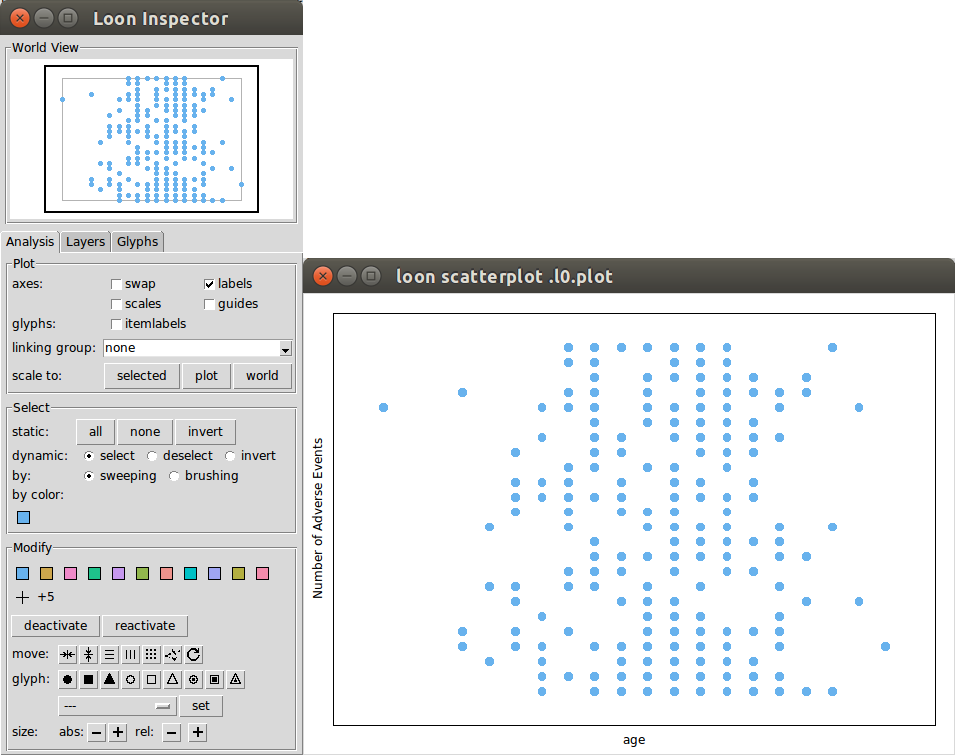

\begin{center}
\vspace{-3em}

{\fontsize{14}{14}\color{Gray}\sffamily\textbf{PhUSE 2016}}

\vspace{1em}

{\fontsize{9}{9}\sffamily \textbf{Paper DV03}}

\vspace{1em}


{\fontsize{14}{14}\sffamily \textbf{Interactive Data Visualization and Exploration Using the Loon R Package}}

\vspace{1em}

{\fontsize{12}{12}\sffamily Adrian Waddell, F. Hoffmann-La Roche, Basel, Switzerland}

\end{center}

\vspace{1em}

```{r setup, include=FALSE}
knitr::opts_chunk$set(echo = TRUE)
library(knitr)

knit_hooks$set(loon = function(before, options, envir) {
  if (!before) {
    ## after a chunk has been evaluated

    if (is.null(.knitr_print_loonobjs)) return()  # no loon device to be printed
    
    name = paste(options$fig.path, options$label, sep = '')
    
    if (!dir.exists(dirname(name)))
      dir.create(dirname(name), recursive = TRUE)
    
    l_export(.knitr_print_loonobjs, filename = paste0(name, ".png"))
    .knitr_print_loonobjs <<- NULL
    
    if (is.null(options$out.width))
      options$out.width <- "1\\linewidth"
    
    return(paste0('\\begin{center}\n\\includegraphics[width=', options$out.width ,']{', name, '}\n\\end{center}\n'))
  }
})

.knitr_print_loonobjs <- NULL
knitimg <- function(x, ...) {
  .knitr_print_loonobjs <<- x # one for now c(x, ...)
}
```

# Abstract

Loon [1] is an open source toolkit for highly interactive data visualization
with R [2]. Interactions with plots are provided with mouse and keyboard
gestures as well as via command line control and with inspectors. In this paper,
we illustrate how loon's interactive displays and features can be used to
perform an exploratory visual analysis of adverse events data from clinical
trials.


# Introduction

Visualizing data is an essential part of good statistical practice. Plots are 
useful for revealing structure in the data, checking model assumptions, 
detecting outliers and finding unanticipated patterns. Compared to static 
visualization, interactive visualization adds natural and powerful ways to 
explore the data. With interactive visualization an analyst can dive into the 
data and quickly react to visual clues by, for example, re-focusing and creating
interactive queries of the data. Further, linking visual attributes of the data 
points such as color and size allows the analyst to compare different visual 
representations of the data such as histograms and scatterplots.

Loon is a general-purpose toolkit to create interactive graphs such as 
scatterplots and histograms in R. The scatterplot display provides, among other
features, zooming, panning, selection and moving of points, dynamic linking of
plots, layering of visual information such as maps and regression lines, custom
point glyphs (images, text, star glyphs), and event bindings. Event bindings
provide hooks to evaluate custom code at specific plot state changes or mouse
and keyboard interactions. Hence, event bindings can be used to add to or modify
the default behavior of the plot widgets.

Loon is an open source R package that works on Windows, Linux and OSX. Loon's 
installation instructions and manual can be found on the project webpage [1].
Once the package is installed the R-code provided in this paper can be run to
recreate the visualization settings we introduce. The R-code can be also found
on the GitHub repository [3].


# Generating Adverse Events Data

We now present R-code to generate adverse event data for 300 patients that 
include a subset of the variables defined in the ADaM data structure for adverse
events [4]. That is, we only generate variables that are used for the 
visualization settings presented in this paper. We also use native R data types 
whenever possible (e.g. Boolean `TRUE` and `FALSE` instead of character `'Y'` 
and `'N'`, respectively). The variables that we generate are defined as in [4]
and are listed below.

```{r, echo=FALSE}
descr <- c(
  "USUBJID", "Unique Subject ID",
  "SEX", "Gender",
  "AGE", "Age",
  "ARM", "Study Arm",
  "DISCDEAT", "Discontinued Study due to Death",
  "TRTSDT", "Treatment Start",
  "TRTEDT", "Treatment End",
  "AESEQ", "Sequence Number",
  "AETERM", "Reported Term for the Adverse Event",
  "AESEVN", "Analysis Severity/Intensity (N)",
  "ASTDT",  "Analysis Start Date",
  "AENDT", "Analysis End Date",
  "ADURN", "Duration of Adverse Event"
)

df <- as.data.frame(matrix(descr, ncol=2, byrow=TRUE))
names(df) <- c("Name", "Description")

kable(df)
```

The list of adverse event terms and severity numbers are taken from Table 5.3.1 
in [4]. We generate the adverse events data such that patients in arm A are 
expected to have more adverse events and are more likely to die during the 
study. The number of patients is balanced between the two study arms (i.e. 150 
patients in arm A and 150 in arm B). For simplicity purposes, we do not include
missing data values. The following code block generates the adverse events data 
later used for our visual exploration. Explaining this code is out of the scope 
of this paper as the reader does not need to understand it in detail to be able 
to follow the discussion.

```{r}
set.seed(1)

aeterms <- c(
  'HEADACHE', 'CHRONIC BACK PAIN', 'NOSE BLEEDING RIGHT NOSTRIL',
  'PROBLEMS OF HYPOTENSION', 'LOOSE STOOL', 'ABDOMINAL DISCOMFORT',
  'DIARRHEA', 'ABDOMINAL FULLNESS DUE TO GAS', 'NAUSEA (INTERMITTENT)',
  'WEAKNESS', 'HYPOTENSIVE'
)
aesevns <- c(1, 2, 1, 1, 3, 2, 2, 1, 1, 1, 3)

normalize <- function(x)x/sum(x)
weightsA <- normalize(dlnorm(seq(0, 5, length.out = 25), meanlog = 3))
weightsB <- normalize(dlnorm(seq(0, 5, length.out = 25)))

l.aae <- Map(function(id, ARM) {

  TRTSDT <- as.Date("2016-01-01", "%Y-%m-%d") + sample(0:365, 1, replace = TRUE)
  TRTEDT <- TRTSDT + 200 + rbinom(1, 60, 0.5)
  DISCDEAT <- sample(c(TRUE, FALSE), 1, prob=if(ARM=="ARM A") c(.3,.7) else c(.15,.85))
  
  n_ae <- sample(1:25, 1, prob=if(ARM == "ARM A") weightsA else weightsB)
  i <- sample(1:length(aeterms), size=n_ae, replace=TRUE, prob=c(6,rep(1,10))/16)
  ASTDT <- sample(seq(TRTSDT, TRTEDT-1, by=1), n_ae, replace = TRUE)
  ADURN <- sample(1:18, size=n_ae, replace=TRUE)
  AENDT <- ASTDT + ADURN
  ii <- order(ASTDT)  
  if(DISCDEAT & any(AENDT>TRTEDT)) {
    AENDT[AENDT>TRTEDT] <- TRTEDT
    ADURN <- as.numeric(AENDT - ASTDT)
  } 
  
  list(
    USUBJID = id,
    SEX = sample(c('F', 'M'), 1),
    AGE = 20 + rbinom(1, size=40, prob=0.7),
    ARM = ARM, DISCDEAT = DISCDEAT,
    TRTSDT = TRTSDT, TRTEDT = TRTEDT,
    aes = list(
      AESEQ = 1:n_ae, AETERM = aeterms[i],
      AESEVN = aesevns[i], ASTDT = ASTDT[ii],
      AENDT = AENDT[ii], ADURN = ADURN[ii]
    )
  )
}, seq(1, 300, by=1), sample(rep(c('ARM A', 'ARM B'), 150), replace = FALSE))
```

Notice that we specify the random number generation seed at the very beginning 
(line 1) so that the data can be re-created exactly the same. The resulting list
`l.aae` contains 300 lists, each of them containing the generated adverse events
data corresponding to one patient. The non-rectangular data structure of `l.aae`
is not in the AdAM format described in [4]. The steps necessary to transform 
`l.aae` into the AdAM format are as follows:

```{r}
aae <- Reduce(rbind, Map(as.data.frame, l.aae))
names(aae) <- gsub("aes.", "", names(aae), fixed = TRUE)
```

\newpage
To print the first 3 rows of the rectangular data frame `aae` we can use the 
`head` function as follows.

```{r}
head(aae, 3)
```

However, for the the visual analysis with loon, we use the `l.aae` data 
structure to query and transform the data as needed to create and modify the 
plots.

# A Visual Exploration of the Adverse Events Data

To start a loon session, we first have to load the loon R-package into the
active R session:

```{r, results='hide', message=FALSE}
library(loon)
```

We start our exploratory analysis by looking at the relationship between age and
the number of adverse events. The following code retrieves the age and number of
adverse events for each patient:

```{r}
age <- sapply(l.aae, function(x)x$AGE)
naes <- sapply(l.aae, function(x)length(x$aes$AESEQ))
```

Next, we create a loon scatterplot that displays age on the x-axis and the 
number of adverse events on the y-axis:

```{r}
p <- l_plot(x=age, y=naes, ylabel="Number of Adverse Events")
```

This `l_plot` call creates two windows, the scatterplot as seen on the right
side in the figure below and the loon inspector as seen on the left side.

```{r, echo=FALSE, out.width="0.8\\linewidth", fig.align="center"}

```

The loon inspector provides a graphical user interface for modifying and
overseeing the scatterplot. For example, to display the x and y scales on the
scatterplot display one can check the "scales" check-box in the loon inspector.
The scatterplot display supports a number of direct interactions such as 
mouse-scrolling for zooming, right-click dragging for panning and left-click 
dragging for selecting points. Selected points can be modified with the tools 
provided in the "Modify" section of the loon inspector (e.g. point color, point 
size and point glyph). The return value of `l_plot`, here assigned to `p`, is a 
plot handle to access and modify the scatterplot via the command line. For 
example, `p['color']` returns a vector with the hexadecimal encoded color 
representation of each of the 300 points, and `p['size'] <- 5` sets the size of 
every point to 5.

One issue with the above scatterplot is the over-plotting of the point glyphs, 
that is, it is not possible to distinguish all 300 points. One way to deal with 
over-plotting is to jitter the points, that is, to add a small amount of noise 
to the point locations. In loon, this can be done by first selecting all the 
points and then by pressing the 
\fbox{\includegraphics[scale=0.4]{images/jitter}} button on the inspector. 
Jittering might move the points outside the current plotting area of the 
scatterplot. In order to adjust the plotting area to include all points, one 
option is to press the *scale to world* button on the inspector. In addition to 
jittering the points, one can also choose a point glyph with an outline so that 
the individual points are better distinguished from each other. One way to do 
that is to press the \fbox{\includegraphics[scale=0.4]{images/ccircle}} button 
on the inspector while the points are still selected. After deselecting the 
points by pressing *select none* on the inspector, the scatterplot will then
look similar to the following plot. Note that the seed in R does not influence
the random jittering noise for loon as loon is implemented in Tcl and Tk.
Therefore, the plots with jittering are not perfectly reproducible here and that
is the case with the third next scatterplot.

```{r, echo=FALSE, loon=TRUE, out.width='.5\\linewidth'}
l_move_jitter(p, "all")
l_scaleto_world(p)
p['glyph'] <- 'ccircle'
# p['showScales'] <-TRUE
knitimg(p)
```

From the above jittered scatterplot we note that, for example, more patients 
were sampled from the center of the age range. Next, we encode gender and study 
arm as visual attributes onto the scatterplot. Our goal here is to check whether
there is an obvious relation between age, study arm, gender and the number of 
adverse events. To do so, we encode gender with different point glyphs and the 
study arm as glyph colors in the scatterplot of the number of adverse events vs.
age from above.

```{r}
p['glyph'] <- ifelse(sapply(l.aae, function(x)x$SEX)=='F', 'ccircle', 'csquare')
p['color'] <- ifelse(sapply(l.aae, function(x)x$ARM)=='ARM A', 'tan', 'steelblue')
```

```{r, loon=TRUE, echo=FALSE, out.width="0.5\\linewidth"}
knitimg(p)
```

We can now see that patients from arm A (tan colored) tend to have more adverse 
events than the ones from arm B (steelblue colored), which is not surprising 
given the way we generated the number of adverse events for each arm. Also, 
gender seems to be evenly distributed among the two study arms, age and the 
number of adverse events. Note that, instead of modifying one plot state at a 
time as done in the above code chunk, we can also use the `l_configure` function
to modify multiple scatterplot states in one function call. It is also possible 
to attach a label to each scatterplot point that can be queried with the mouse 
pointer resulting in a "tool-tip" with the *itemlabel*. For example, the *itemlabel*
could be the patient `USUBJID` with a table of the adverse events, as seen
below.

```{r}
t.label <- unlist(Map(function(x) {
  t.x <- table(x$aes$AETERM)
  paste(c(
    paste0('Patient ', x$USUBJID,':'),
    apply(cbind(t.x, names(t.x)), 1, function(x)paste(x, collapse = ' '))
  ), collapse = '\n')
}, l.aae))

l_configure(p, itemlabel=t.label, showItemlabels=TRUE)
```

```{r, echo=FALSE, out.width="0.5\\linewidth", fig.align="center"}

```

Next, we plot a histogram with the number of headaches per patient.

```{r}
h <- l_hist(
  x = sapply(l.aae, function(x)sum(x$aes$AETERM == 'HEADACHE')),
  xlabel = 'Number of Headaches per Patient',
  yshows = 'density',
  showScales = TRUE,
  binwidth = 1
)
```

```{r, loon=TRUE, echo=FALSE, out.width='.5\\linewidth'}
knitimg(h)
```

For `l_hist`, the `yshows` argument specifies that the histogram displays the 
density rather than the frequency and the `binwidth` argument specifies a 
particular bin width for the binning algorithm. The 
\includegraphics[scale=0.2]{images/binhandle} element in the histogram display 
can be used to adjust the binning origin and the bin width on the histogram 
interactively. This histogram of headaches count per person becomes particularly
interesting when linking it with the information shown on the scatterplot above.
That is, loon synchronizes certain states automatically for linked displays. For
example, for a linked scatterplot and histogram, some of the linked states 
include `color`, `selected` and `size`. In the following code, we link the 
scatterplot of the number of adverse events vs. age with the histogram of number
of headaches per patient. Next, we select all the patients in the scatterplot 
that have more than 15 adverse events and are older than 46. This selection will
propagate to the histogram display as it is now linked with the scatterplot. By
default, selected points are highlighted in magenta in loon's displays.

```{r}
p['linkingGroup'] <- "aes"
l_configure(h, linkingGroup="aes", sync="pull", showStackedColors=TRUE)
p['selected'] <- naes > 15 & age > 46
```

```{r, echo=FALSE, results="hide"}
l_export(p, filename = "images/p_sel.png")
l_export(h, filename = "images/h_sel.png")
system('convert images/p_sel.png images/h_sel.png +append images/linked_selected.png')
```

```{r, echo=FALSE}

```

In the above code we have to specify the `sync` argument so that loon knows how
to initially align the linked states between the linked displays. We also set
the `showStackedColors` to `TRUE` so that the `color` state of the histogram
gets visually encoded.

We end this short introduction of loon with a plot that shows the individual 
adverse events on a time line for each patient that is selected in the
scatterplot or histogram displays. The adverse events are colored *orangered* if
they are of severity 3 and *dodgerblue* otherwise. We also encode the treatment
period with a rectangle that is colored *lemonchiffon1* if the patient
discontinued the study due to death and *gray* otherwise. This plot can be useful
in investigating whether there are any patterns within the adverse events data
such as an increase in frequency and severity of adverse event preceding a
patient's death. This visualization uses some advanced loon features such as
event bindings and layers. More information about these features can be found in
the loon manual [1].

```{r}
createAEplot <- function() {
  pae <- l_plot(showItemlabels=TRUE, xlabel="Treatment Relative Day", showScales=TRUE)
  
  rectHeight <- 4
  y <- 0
  
  scale01 <- function(x) {
    dx <- diff(range(x))
    if (dx == 0) rep(0, length(x)) else (x-min(x))/dx
  }
  
  draw_patient <- function(x) {
    patient_label <- paste("Patient", x$USUBJID)
    g <- l_layer_group(pae, label=patient_label)
    l_layer_rectangle(
      pae, parent=g,
      x = c(1, x$TRTEDT - x$TRTSDT + 1), y = c(y, y+rectHeight),
      color = if(x$DISCDEAT) "lemonchiffon1" else "gray80",
      linecolor = "",
      itemlabel = paste("Treatment Period for Patient", x$USUBJID)
    )
    l_layer_text(pae, parent=g, text=patient_label, x=1, y=y+rectHeight,
                 justify='left', anchor='nw', color="black")
    
    if (length(x$aes$AESEQ)>0) {
      xcoords <- Map(function(t0, t1) as.numeric(c(t0, t1)-x$TRTSDT+1),
                     x$aes$ASTDT, x$aes$AENDT)
      tE <- list()
      ycoords <- Map(function(j)c(j, j), scale01(unlist(Map(function(xc) {
        k <- vapply(tE, function(tEi) xc[2]>tEi, logical(1))
        i <- if (any(k)) which(k)[1] else length(tE) + 1
        tE[[i]] <<- xc[2]
        i
      }, xcoords))) * rectHeight + y)
      col <- ifelse(x$aes$AESEVN == 3, "orangered", "dodgerblue4")
      if (length(xcoords) == 1) 
        l_layer_line(pae, parent=g, x=xcoords[[1]], y=ycoords[[1]],
                     itemlabel=x$aes$AETERM, linewidth=2, color=col)
      else
        l_layer_lines(pae, parent=g, x=xcoords, y=ycoords,
                      itemlabel=x$aes$AETERM, linewidth=2, color=col)
    }
    y <<- y + rectHeight + 3
    l_scaleto_world(pae)
  }
  list(
    updateWith = function(selected) {
      y <<- 0
      for (layer in l_layer_getChildren(pae, "root")) 
        if (layer != "model") l_layer_expunge(pae, layer)
      if (sum(selected)>0)
        Map(function(x)draw_patient(x), l.aae[selected])
    },
    widget = pae
  )
}
```

The `createAEplot` function creates a plot and returns a list with the plot 
widget handle and a closure for updating the adverse events plot with the subset
of selected patients. The `createAEplot` function can be executed multiple times
to create multiple adverse events plots that do not interfere with each other.
Next, we create such an adverse events plot and then add a `selected` state 
change binding to the scatterplot widget which updates the plot every time
different points are selected on the scatterplot or the linked histogram.

```{r, results="hide"}
showAEs <- createAEplot()

l_bind_state(p, "selected", function() {
  showAEs$updateWith(p['selected'])  
})

p['selected'] <- naes > 23 & sapply(l.aae, function(x)x$ARM) == 'ARM A' & 
  sapply(l.aae, function(x)x$SEX) == 'M'
```


```{r, loon=TRUE, echo=FALSE, out.width="0.8\\linewidth"}
# l_size(showAEs$widget) <- c(652, 700)
knitimg(showAEs$widget)
```

This adverse events plot supports *itemlabels* for the individual adverse
events. Notice that the adverse events lines are stacked in a space-efficient
manner.

# Conclusion

In this paper, we illustrate some of loon's displays and features in the context
of adverse events data. We generate the data to closely match the AdAM data 
structure specifications for adverse events [4]. Therefore, it should be
possible to use the code provided in this paper to analyze adverse events data 
from actual clinical trials without too much additional work. The tools and 
techniques used for our visualization settings include jittering, encoding
information with glyph color and shape, interactive querying using tool-tips,
linking, layering, and bindings. We encourage the reader to run this visual
analysis on a local installation of R and loon and further explore loon's 
features. Loon is a powerful interactive visualization toolkit that has many 
more features and capabilities to visually explore high-dimensional data.


# References
[1] Loon's website with installation instructions and user manual: \url{http://waddella.github.io/loon/}\newline
[2] R Core Team (2016). R: A Language and Environment for Statistical Computing. R
Foundation for Statistical Computing. Vienna, Austria.\newline
[3] GitHub repository with R-code for PhUSE 2016 adverse events paper by Adrian Waddell: \url{http://github.com/waddella/phuse2016_adverse_events}\newline
[4] Analysis Data Model (ADaM) Data Structure for Adverse Event Analysis: \url{http://www.cdisc.org/system/files/all/standard_category/application/pdf/adam_ae_final_v1.pdf}

# Acknowledgements

Loon is joint work with Prof. R. Wayne Oldford from the University of Waterloo,
Waterloo, Canada.

# Contact Information

Your comments and questions are valued and encouraged. Please contact the author at:

Adrian Waddell\newline
F. Hoffmann-La Roche\newline
Grenzacherstrasse 124\newline
4070 Basel\newline
+41 61687 47 33\newline
adrian.waddell@roche.com\newline
\url{http://adrian.waddell.ch}
